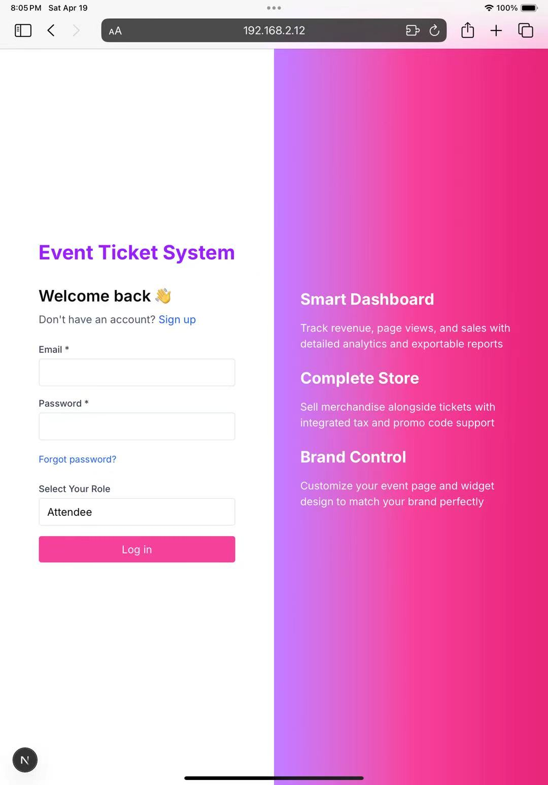

# Event Ticketing and QR Code Check-in System

# **Team Information**


| Name         | Student Number | Email                                                                         |
| ------------ | -------------- | ----------------------------------------------------------------------------- |
| Yiren Zhao   | 1005092427     | [yiren.zhao@mail.utoronto.ca](mailto:yiren.zhao@mail.utoronto.ca)             |
| Yining Wang  | 1005728134     | [yning.wang@mail.utoronto.ca](mailto:yning.wang@mail.utoronto.ca)             |
| Yuting Zhang | 1011474897     | [ytlluvia.zhang@mail.utoronto.ca](mailto:ytlluvia.zhang@mail.utoronto.ca)     |

## Video demo

https://drive.google.com/file/d/1Hq_-tGKYt0PiNFJCN-WKe6-93Ox3vX-7/view?usp=share_link

# Motivation

Small to medium organizations face significant event management challenges without enterprise-level resources. Current processes rely on manual methods—paper forms, spreadsheets, and emails—creating error-prone workflows that scale poorly. On-site check-in using printed lists causes long queues and inaccurate attendance records. Organizations lack analytical tools for data-driven planning and struggle to maintain consistent communication with attendees.

These inefficiencies divert administrative resources away from improving core event experiences and create negative impressions for participants, potentially damaging reputation and reducing future attendance. Paper-based processes also conflict with growing sustainability priorities.

Our team, drawing from personal experience as both organizers and attendees, recognized the opportunity to create an accessible web-based platform addressing these challenges. Our solution streamlines the event lifecycle to reduce administrative overhead, enhance attendee experience, enable data-driven decisions, improve communication, and support sustainability goals while remaining intuitive for users of all technical backgrounds.

# Objectives

Our primary objective was to develop a comprehensive, user-friendly event ticketing and check-in system that balances robust functionality with intuitive design. We aimed to create a platform accessible to users with varying technical expertise while providing sophisticated event management tools.

We sought to simplify event creation and registration through an intuitive interface for customizable events with multiple ticket types, tailored registration forms, and flexible pricing options including promotional discounts. This would allow precise event configuration without technical assistance.

We focused on streamlining check-in through an efficient QR code verification system that functions effectively on mobile devices, eliminating manual procedures, reducing queues, and minimizing errors. Our goal was to enable staff to process attendees quickly regardless of location.

We aimed to provide real-time analytics and reporting for actionable insights into registration patterns, attendance metrics, and demographics, empowering data-driven decisions during planning and execution phases to optimize resources and improve experiences.

Additionally, we prioritized robust waitlist management for addressing demand fluctuations through a transparent, automated system for handling capacity constraints and ticket reallocation when space becomes available.

Finally, we committed to full responsive design across all device types, recognizing that both organizers and attendees frequently use mobile devices for event-related activities.

Through these objectives, our project delivers a cohesive solution addressing the multifaceted challenges of event management while remaining accessible to organizations without extensive technical resources.

# Technical Stack

Our Event Ticketing and QR Code Check-in System implements a comprehensive technical stack that aligns with modern web development practices while fulfilling the course requirements. We selected the Next.js Full-Stack approach as our architectural foundation, using its integrated capabilities for both frontend and backend development within a unified framework.

### Frontend

We built the frontend using Next.js 15 with the App Router and React Server Components for efficient server-side data fetching. We used TypeScript throughout the application to ensure type safety and catch bugs early, aligning with the concepts introduced in lectures about TypeScript and Next.js. For styling, we adopted Tailwind CSS along with shadcn/ui to compose accessible, reusable UI components, following the best practices covered in lecture on Modern Styling Solutions. Interactive visualizations such as attendance rates and revenue stats are implemented with Chart.js, which is dynamically imported inside client components to avoid unnecessary server load. Our dashboards and check-in UI are all implemented in React, with client-side state management and routing.

### Backend

Our backend architecture combines Next.js API routes for most server-side logic, collaborating with the framework’s built-in support for backend development as introduced in the course. . This design is inspired by the backend development workflows demonstrated in early course weeks. For database interactions, we used Prisma ORM connected to a PostgreSQL instance hosted on Render, directly applying knowledge from Database Management lecture, enabling type-safe database queries and simplified database schema management. Critical update operations, such as check-ins and ticket modifications, are grouped logically and follow design principles introduced in the course. The operations are kept isolated and minimal to guarantee data consistency.

### Real‑time & State
//TODO
Socket.io 4 provides WebSockets; a single /lib/socket.ts keeps the client connection. Frontend state is co‑located: Server Components for immutable props, Zustand store for volatile real‑time counters, React‑Query for fetch/optimistic update.

### Additional Technologies

Additional technologies incorporated into our stack include QRCode.js for generating unique ticket identifiers, React-QR-Reader for implementing the scanning functionality during check-in, and Chart.js for visualizing attendance data in the analytics dashboard. We implemented real-time updates for the check-in dashboard using WebSockets, ensuring immediate synchronization of attendance data across multiple devices.

# Features

Our project provides a comprehensive set of features designed to address the challenges of event management. These features fulfill both the course requirements and our project objectives, delivering a valid solution for event ticketing management.

## Advanced and key features

### Authentication & Authorization

We implemented role-based authentication using NextAuth.js with a Credentials Provider, where each user receives a signed JWT that encodes both their user ID and role (Organizer, Staff, or Attendee). Upon login, the system verifies credentials using bcrypt and checks the selected role against the database before issuing the token. We use a stateless session strategy (strategy: "jwt"), allowing both the frontend and backend to access the user’s identity and role without querying a session store. A custom middleware layer parses the JWT on every request and attaches the user’s role and ID to the request context, enabling consistent, role-aware access control across frontend components and backend API routes. This ensures that only organizers can create events or manage promotions, only staff can perform event check-ins, and only attendees can view their purchased tickets. Input validation is performed during login to ensure all required fields are provided and credentials match stored records. We also handle invalid sessions, missing tokens, and unauthorized access with proper HTTP error responses. The implementation directly reflects the contnets covered with Better Auth and mirrors the role-based guard structures, with the objectives of building secure, authenticated flows and protecting sensitive routes based on user roles.

### Real‑time communication
//TODO
We implemented check-in and purchase events emit ticketCheckedIn and ticketPurchased messages via Socket.io. Organizers and staff clients subscribe using a shared context provider. Dashboards update instantly—mirroring the real-time components emphasized in class and showing advanced state management via Zustand and React Query. Organizers and Staff dashboards subscribe to these channels via a React Context wrapper, allowing components like counters, progress bars, and bar charts to update instantly—without requiring page reloads. This setup directly reflects the class coverage of real-time communication and demonstrates an applied understanding of WebSocket lifecycle management, as well as frontend reactivity.

### File handling and processing

For image and QR code support, we implemented a flexible upload interface that accepts both image files and PDF documents, allowing staff to check in attendees using screenshots, printed tickets, or email attachments. Uploaded files are parsed on the client side using pdf.js (for PDFs) and html5-qrcode (for image-based decoding). For PDFs, we stream the first page using pdfjs-dist, render it to a canvas, and attempt QR extraction. These functionalities demonstrate our understanding of client-side file processing and expand on the image-handling techniques. Input validation checks are in place to reject unsupported file types or empty uploads, and try-catch blocks provide feedback on failed QR-code decoding attempts. This feature demonstrates hands-on understanding of file handling and user experience design.

We also implemented pre-signed upload URLs for direct S3 uploads from the client, using PUT requests to cloud storage, a strategy directly covered on DigitalOcean Spaces. Although we used AWS S3 instead of Spaces, the API model and security mechanisms are fully compatible. //TODO QR codes for each ticket are generated on the fly as base64 Data URLs, removing the need for server-side temp files or binary blobs. This architecture reflects our grasp of client-cloud integration, media processing, and external service orchestration.

### API integration with external services

We integrated several external-service APIs to enhance functionality and user experience. For instance, the Google Maps Embed API is used on the Organizer Event Detail Page to provide a live map preview of the event location. When an organizer sets a location, it is encoded into a query string and passed to an embedded <iframe> powered by Google Maps, enabling people to visualize where the event takes place and improving usability. This implementation reflects the UI enrichment principles, where dynamic, data-driven components were emphasized. Beyond Maps, Resend is used to dispatch HTML-based confirmation emails with embedded QR codes, and AWS S3 handles image uploads using the same API model as DigitalOcean Spaces introduced in class. Each service is integrated with error handling and secured access, showing best practices from the course.

### Event Creation with Schema-Driven Forms

Organizers can dynamically configure registration forms—selecting which fields to include (e.g., description, location). These toggles are persisted in an EventFormField table and hydrated into React forms at runtime. This pattern of schema-driven UI and dynamic form rendering links to course contents on advanced React state and reusable components.

### Tiered Ticket Types and Promo Codes

Our platform supports tiered ticket pricing and discount codes, enabling organizers to define multiple ticket types per event (Early Bird, VIP etc.), each with its own price and inventory. Promo codes offer either fixed or percentage-based discounts and support constraints like usage limits and validity dates. These codes are validated server-side during purchase using atomic Prisma transactions, ensuring consistency and enforcing ACID properties, aligning with the PostgreSQL & Prisma ORM part covered by lecture. Promo management is handled through dynamic React forms and integrated CRUD APIs, reflecting the schema-driven UI and backend integration patterns emphasized in assignments.

### QR Code Generation and Validation: Real-Time QR-Code Check-In Interface (Camera, Images, and PDFs), and Mobile-responsive check-in interface

Upon ticket purchase, a unique code (e.g., TICKET-xxxx) is generated and rendered into a QR image using the qrcode package. This image is embedded into an HTML email sent via the Resend API, showcasing real-world integration with external services as covered in lecture about API Integration.The Staff dashboard includes a real-time check-in system. It supports camera scanning via html5-qrcode, drag-and-drop image uploads, and even PDF parsing. The check-in interface is fully mobile-responsive, optimized for phones and tablets without any native app. This design highlights our ability to deliver production-grade UX beyond the desktop environment.

### PostgreSQL for transaction data: Data Consistency via Prisma Transactions

Critical updates (like check-ins and promo validation) are provided by Prisma to guarantee updates across multiple tables (e.g., both Ticket and PurchasedTicket). This design reflects proper transaction usage discussed in class and implemented in assignments. Input data is sanitized and type-checked before transactions execute, with rollback logic automatically applied on error handelling.

### Attendance analytics and reporting
Both staff and organizers can view charts for attendance and revenue (Chart.js). Detailed statistics can also be downloaded as CSV via server-generated Content-Disposition responses. Ticket type breakdowns (Total, Sold, Checked-In) are streamed from API routes and rendered into Excel-compatible file, satisfying emphasis on backend data processing and professional workflows. All numeric inputs are validated for type and range, and missing fields return appropriate HTTP errors.

### Automated email confirmations
After a successful ticket purchase, our system automatically sends a confirmation email using the Resend email API. This email includes the event name, event time, ticket type, a unique ticket code (e.g., TICKET-QmwYBfUY), and a QR code that staff can later scan for check-in. We trigger this via a POST to the `/api/email/confirmation` endpoint, passing in the attendee’s email. The message is composed in HTML using dynamic templating with template literals. Input validation ensures all required fields are present and properly formatted before dispatch. Fallback logic handles delivery failures gracefully with console logging and response monitoring. This automation demonstrates our ability to work with third-party APIs and handle errors.

# Development Guide

## Getting Started with Development

### Dependencies Installation

Begin by installing all required dependencies:

```bash
npm install
```

If you encounter a Tailwind CSS resolution error(probably won't) such as:

```bash
⨯ ./src/app/globals.css
Error evaluating Node.js code
Error: Can't resolve 'tailwindcss' in '/path/to/project/src/app'
```

Install the latest version of Tailwind CSS:

```bash
npm install tailwindcss@latest
```

### Database Setup

Initialize and reset the database with:

```bash
npx prisma migrate reset
```

Create the initial database schema:

```bash
npx prisma migrate dev --name init
```

### Launch Development Server

Start the application in development mode:

```bash
npm run dev
```

The application should now be running at http://localhost:3000.

# Deployment Information

Our Event Ticketing and QR Code Check-in System is deployed and accessible at https://github.com/YirenZzz/EventTicketing.

The deployed application maintains all functionality available in the development environment, including user authentication, event management, ticket generation, QR code scanning, and analytics reporting. Users can access the system through any modern web browser on both desktop and mobile devices without requiring additional software installation.

# **User Guide**

## User Authentication System

### Account Creation Process

The system supports three user roles: Organizer, Staff, and Attendee. To access the platform's features, users must first create an account through the registration process.

### Registration Procedure

1. From the landing page, locate and select the "Sign Up" button in the top navigation bar to access the registration interface.


1. On the registration page, complete the required personal information fields and select the appropriate user role (Organizer, Staff, or Attendee) from the dropdown menu.


1. The registration process is identical for all user roles, though permissions and accessible features will differ based on the selected role.


1. The system validates email addresses to prevent duplicate registrations. If you attempt to register with an email address already in the database, the system will display an "Email already registered" notification and prompt you to use a different email address.


The registration of organizer and staff is the same as attendee.

### Authentication Process

1. After successful registration, you will be directed to the login page. Returning users can access this page directly by selecting the "Login" button from the homepage.


1. Enter your credentials in the designated fields. The system will verify this information against the database. If your credentials cannot be verified, the system will display an authentication error message.


1. Upon successful authentication, you will be redirected to the role-appropriate dashboard interface, which provides access to your authorized features and functions.


The dashboard serves as your central control panel for managing events, tickets, or registrations, depending on your assigned role in the system.

## Event Creation and Customization

The platform provides organizers with comprehensive tools to create and customize events with tailored registration forms. The following steps outline the event creation process:

### Accessing Event Management

1.  Navigate to the Events dashboard from the main organizer interface. This centralized location displays all your current and past events in a structured format.


### Creating a New Event

1. Select the "Create Event" button located in the upper right corner of the Events dashboard to initiate the event creation process.

   

   1. The system will present the Event Configuration interface, where you can define the essential parameters of your event.


### Configuring Event Parameters

1. Complete the event configuration form with the necessary details: Event name, Detailed description, Physical or virtual location, Date and time parameters (start and end).


1. Required fields are clearly marked with red asterisks (\*) to ensure all critical information is provided.


3.  The system performs validation checks upon submission:

- If required fields are incomplete, the system will display targeted error messages directing you to complete the necessary information.
- When all required fields are properly completed, the system will process your submission and create the event.


### Event Status Classification

The system automatically categorizes events based on their temporal relationship to the current date:

- Events with start times in the future are classified as "Upcoming Events"
- Events with start times in the past are classified as "Past Events"

This automatic classification ensures proper organization and filtering of events within the management interface.


## Tiered Ticket Pricing and Discount Management

The system offers robust capabilities for implementing differentiated pricing strategies and promotional discounts. This section details the configuration of tiered ticket pricing and discount codes.

### Accessing Ticket Configuration

1.  From the Events dashboard, locate the desired event and select its name. Event titles appear with interactive underlining when hovering over them to indicate their clickable nature.


## Location Integration

The system provides seamless integration with mapping services. Select the event location link to access the venue's precise location via Google Maps, offering attendees clear geographical context.


### Creating Tiered Ticket Options

1. Within the event management interface, navigate to the ticket configuration section to establish various ticket categories.

2. Select the "Add Ticket Type" button to create a new ticket category.

3. For each ticket type, specify:

- Descriptive name (e.g., "Early Bird," "Standard," "VIP")
- Pricing parameters
- Available quantity
- Optional description of benefits or restrictions


4. The system supports multiple ticket tiers for a single event, allowing for sophisticated pricing strategies that can address different market segments or provide incentives for early registration.


### Implementing Promotional Discounts

1. Access the discount management functionality by selecting "Promo Code" from the navigation sidebar.


2. Select "New Promo Code" to initiate the creation of a promotional discount.


3. Associate the discount code with a specific event and define its parameters:

- Unique promotional code
- Discount value (percentage or fixed amount)
- Validity period
- Usage limitations (if applicable)


This comprehensive pricing and promotion system enables organizers to implement sophisticated marketing strategies, drive early registrations, and offer targeted incentives to specific attendee segments.

## QR Code Generation and Validation System

The platform implements a robust QR code system that facilitates efficient event check-in processes. This section outlines the ticket purchase, QR code generation, and validation workflow.

### Attendee Ticket Acquisition

1. After authenticating with attendee credentials, users can access available events through either the sidebar navigation menu or the "Browse Events" section of the attendee dashboard.


2. Events with available tickets display an actionable "Buy Now" button adjacent to each event listing, indicating ticket availability. Select the "Buy Now" button to initiate the ticket purchase process for the desired event.


3.  Upon successful transaction completion, the system automatically generates a unique ticket with an embedded QR code.


### Ticket Management and Access

The system redirects attendees to their personalized ticket view immediately after purchase, displaying the generated QR code and essential event information.

Attendees can also access their tickets at any time through the dashboard interface, which provides a comprehensive overview of all purchased tickets across multiple events.


### Ticket Documentation

The platform provides document export functionality through a "Print" option, enabling attendees to generate a PDF version of their ticket.The exported PDF includes:


- The unique QR code for event check-in
- Essential event details (name, date, location)
- Ticket-specific information (ticket type, attendee name)
- Terms and conditions (if applicable)

This digital ticket system eliminates the need for physical tickets while maintaining security through unique QR codes that are validated during the check-in process.

## Real-Time Check-In Management System

The platform provides staff members with a comprehensive real-time check-in system that enables efficient attendee verification and event access control. This section details the check-in process and monitoring capabilities.

### Accessing the Check-In Interface

Staff members can access the check-in functionality by navigating to the staff portal after authentication.


Select "Check-In Lists" from the navigation options to access the attendee verification interface.


### Multiple Verification Methods

The system supports multiple verification methods to accommodate various operational scenarios:

- **Document Upload Verification**: Staff can upload PDF tickets that attendees have previously downloaded or printed. The system processes the document to extract and validate the QR code.
- **Image Scanning Capability**: The interface supports processing of screenshot images containing QR codes, providing flexibility when attendees present tickets on devices.
- **Real-Time Camera Scanning**: Staff can activate the device camera to scan QR codes directly from attendees' physical or digital tickets, facilitating rapid verification.


### Validation and Status Updates

1. Upon scanning a valid ticket, the system immediately updates the attendee's status in the database to "Checked In."
2. If a ticket has already been processed, the system displays an "Already Checked In" notification, preventing duplicate entries and potential unauthorized access.
3. All check-in activities are recorded in real-time and displayed under the corresponding event in the events section, providing staff with continuous visibility of attendance status.


### Attendee Information Access

The check-in system provides seamless navigation to detailed attendee information pages, where staff can view comprehensive ticket information and attendance history.


This integrated check-in system enhances event security, streamlines attendee processing, and provides organizers with accurate, real-time attendance data for improved event management.

## Attendance Analytics and Reporting System

The platform provides comprehensive analytics and reporting capabilities that enable organizers and staff to monitor attendance metrics and gain actionable insights. This section details the analytical features available through various interfaces.

### Organizer Analytics Dashboard

Organizers can access consolidated attendance data through the primary dashboard interface, which presents key metrics in an intuitive visual format.


The system generates quantitative summaries of ticket distribution across different categories. For example, an event with 300 total tickets might display a breakdown showing 200 VIP tickets and 100 Basic tickets, providing clear visibility into registration patterns.

Check-in status reports are accessible through dedicated reporting interfaces, allowing organizers to monitor attendance rates in real-time and identify potential issues with event access.


### Event-Specific Analytics

Within individual event management screens, organizers can access detailed analytics specific to each event. The interface provides visualization of registration trends, ticket sales velocity, and attendance patterns to support data-driven decision-making.


### Ticket Category Analysis

Organizers can drill down into specific ticket categories by selecting individual ticket type names within the analytics interface.

This detailed view provides category-specific metrics including: Total tickets sold, Revenue generated, Attendance rate and Demographic information (when collected).


### Staff Analytical Tools

Staff members have access to similar analytical capabilities through their dedicated interface, allowing them to monitor check-in progress and attendance patterns during event operations.

The staff analytics dashboard emphasizes operational metrics relevant to entrance management and attendee flow.


### Data Filtering and Search Functionality

The system incorporates advanced filtering and search capabilities that enable users to isolate specific segments of attendance data based on various parameters. And these data management tools support customized reporting and targeted analysis of specific attendee segments or ticket categories.


The analytics and reporting system serves as a valuable decision support tool, providing organizers with the quantitative insights necessary for continuous improvement of event management processes and attendee experiences.

## Automated email confirmations

## Waitlist Management System

The platform implements a sophisticated waitlist management system that efficiently handles demand when ticket availability is limited. This section details the end-to-end waitlist process from both attendee and organizer perspectives.

### Waitlist Entry Process

When a specific ticket category reaches its allocation limit, the system automatically transitions from displaying a "Buy Now" option to offering a "Join Waitlist" alternative.


Attendees attempting to purchase sold-out tickets are presented with the option to join the waitlist for that specific ticket category.


Upon selecting "Join Waitlist," the system registers the attendee's interest and assigns a sequential position in the waitlist queue.


### Attendee Waitlist Experience

The attendee dashboard provides transparency regarding waitlist status, displaying the current queue position for each waitlisted ticket.


While waitlisted tickets do not appear in the attendee's active tickets section, the system maintains visibility of the waitlist position to set appropriate expectations.

### Organizer Waitlist Management

Organizers have comprehensive visibility of waitlist status through the event management interface, which displays:


The waitlist management interface empowers organizers to release additional tickets when capacity increases or cancellations occur.

### Ticket Release Mechanism

When additional capacity becomes available, organizers can specify the number of tickets to release through the numeric input field in the waitlist management interface.

The system automatically allocates released tickets based on waitlist position, prioritizing attendees with lower queue numbers.


Another attendee joined waitlist:


When organizers release tickets, the system processes the allocation in sequential order:

1. If one ticket is released, it is assigned to the attendee in position 1.
2. If multiple tickets are released, they are distributed sequentially through the waitlist until exhausted.


Organizer can set the number of tickets the input box in the upper left corner:


As tickets are assigned to waitlisted attendees, the system automatically adjusts the remaining queue positions to maintain accurate sequencing.

### Attendee Notification

When a waitlisted attendee receives an allocated ticket, the system updates their dashboard to display the active ticket with the associated QR code.


The previously displayed waitlist position is removed, confirming successful ticket acquisition.


### Dynamic Interface Updates

The system maintains accurate status indicators throughout the platform:

- Events with at least one available ticket category display "Buy Now" options
- Events with all ticket categories sold out uniformly display "Join Waitlist" options


This comprehensive waitlist management system enhances the user experience by establishing clear expectations, maintaining transparency, and providing organizers with flexible tools to manage demand effectively.

## Mobile-Responsive Check-In Interface

The platform features a comprehensively optimized mobile experience that ensures all system functionality remains accessible and user-friendly across various device form factors. This section highlights the mobile responsiveness of the check-in system for both attendees and staff.

### Responsive Design Implementation

The system employs responsive design principles throughout the application, automatically adapting layout, typography, and interactive elements to accommodate different screen dimensions.

Navigation elements reconfigure appropriately for mobile devices, maintaining intuitive access to all platform functions while optimizing for touch-based interaction.





The mobile ticket display presents QR codes at optimal resolution and size for reliable scanning, eliminating the need for physical tickets or desktop access.


### Mobile Staff Operations

The check-in system is specifically engineered for mobile usage, recognizing that event staff frequently operate in dynamic environments where desktop access is impractical.


Staff members can perform all check-in functions directly from mobile devices, including:

- QR code scanning using the device camera
- Manual attendee lookup
- Check-in status verification
- Attendance monitoring


Real-time synchronization ensures that check-in operations performed on mobile devices immediately update the central database, maintaining data consistency across all platform access points.

This mobile-optimized approach enhances operational efficiency for event staff while providing attendees with convenient access to their tickets, ultimately streamlining the check-in process and improving the overall event experience.

## PostgreSQL for transaction data

## Cloud storage for event assets

# Individual Contributions

# Lessons Learned and Concluding Remarks

The development of our Event Ticketing and QR Code Check-in System provided valuable insights into both technical implementation strategies and effective project management approaches. Throughout this process, we encountered many challenges that enhanced our understanding of full-stack web development and collaborative software creation.

One significant lesson emerged from our experience implementing the QR code scanning functionality. We initially underestimated the complexity of developing a reliable scanning mechanism that functions consistently across various devices and lighting conditions. Through iterative testing and refinement, we discovered the importance of incorporating error handling and fallback mechanisms to ensure operational reliability even in suboptimal conditions. This experience reinforced the value of progressive enhancement in feature development, ensuring core functionality remains accessible regardless of environmental variables.

Our implementation of real-time synchronization for the check-in process revealed the challenges of managing concurrent operations and data consistency across multiple clients. By adopting WebSocket technology and implementing appropriate state management, we developed a deeper understanding of distributed system principles and their application in web development contexts. This knowledge proved invaluable for creating an efficient, responsive check-in experience that maintains data integrity even during high-volume events.

As we reflect on this project, we recognize several areas for potential enhancement in future iterations. Expanding analytics capabilities to include predictive attendance modeling could provide additional value for event planners. Implementing more sophisticated communication options, such as automated SMS notifications and in-app messaging, would further streamline organizer-attendee interactions. Additionally, enhancing the platform's integration capabilities with external services would increase its utility within broader organizational ecosystems.

In conclusion, the development of our Event Ticketing and QR Code Check-in System provided both practical experience in modern web development techniques and valuable insights into effective software development practices. The resulting platform successfully addresses the challenges identified in our initial motivation, delivering a comprehensive solution that improves efficiency, user experience, and enables data-driven decision making for event management.
